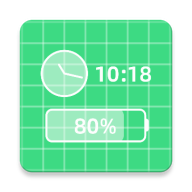

# 浮动状态栏 (Floating Status Bar)

简体中文 | [English](README.md)

浮动状态栏是一款 Android 应用，用于在其他 App 的上层显示当前时间和设备电量。

开发这个 App 主要是为了解决[微信读书墨水屏版](https://ink.qq.com/)在阅读时不支持显示当前时间和设备电量。

## 功能

- **时间和电量显示**：在其他 App 的上层显示当前系统时间和电量状态。
- **支持多样化自定义**：
  - 浮动窗位置和边距调整。
  - 配色、字体大小、字体粗细等样式调整。
- **支持快捷设置**：通过快捷设置启动和关闭浮动状态栏。

## 下载

[在此](https://github.com/LGiki/FloatingStatusBar/releases/latest)下载安装包。

## 截图

## License

MIT.